# Symbol Deviation Mart Use Case

Last updated: 2026-02-27

## Context
The dashboard start page should show one violin distribution per symbol for the selected run and UTC window.

Required signal:
- bucket-level percentage close-price deviation across exchanges
- interactive symbol jump into the existing detail page

Architecture reference:
- `diagrams/5_marts/uml_architecture_symbol_deviation_mart.mmd`
- `diagrams/5_marts/uml_architecture_symbol_deviation_mart.svg`

## Data Model Decision
Decision:
- implement a dedicated mart fact dataset first
- keep dimensions lightweight for now
- evolve to full star schema only when forecast features and additional consumers require stronger dimensional governance

Why:
1. The dashboard needs high-granularity facts (`run_id`, `symbol`, `bucket`) immediately.
2. Forecasting later needs the same grain (`symbol`, `exchange_id`, time bucket) as model input.
3. A narrow fact mart gives fast delivery and avoids premature schema overhead.

## Implemented Mart Objects
1. View:
- `vw_mart_dashboard_symbol_deviation_bucket`

2. Cache table:
- `dash_cache_symbol_deviation_bucket`

3. Cache metadata extension:
- `dash_cache_refresh_metadata.symbol_deviation_bucket_rows`

## Fact Semantics
Grain:
- one row per `(run_id, symbol, bucket_epoch_s)`

Measures:
- `max_price_close`
- `min_price_close`
- `price_diff_abs`
- `price_diff_pct`
- `exchange_count`

Lineage fields:
- `bucket_start_utc`
- `max_price_exchange_id`
- `min_price_exchange_id`
- `max_diff_exchange_pair`

Quality filters:
- source rows must satisfy:
  - `price IS NOT NULL`
  - `is_missing = 0`
  - `is_stale = 0`
- spread row requires at least 2 exchanges in the bucket

## Dashboard Query Priority
For start page violin and symbol detail spread:
1. `dash_cache_symbol_deviation_bucket` (preferred)
2. `vw_mart_dashboard_symbol_deviation_bucket` (fallback)
3. raw `cleansed_market` aggregation (last fallback)

## Forecast Extension Path
Recommended next mart facts:
1. `fact_symbol_exchange_close_bucket`
   - grain: `(run_id, symbol, exchange_id, bucket_epoch_s)`
   - measures: close price, latency/update/disconnect signals, quality flags
2. `fact_symbol_spread_bucket`
   - grain: `(run_id, symbol, bucket_epoch_s)`
   - measures: spread abs/pct and exchange pair attribution

Dimension candidates:
- `dim_symbol`
- `dim_exchange`
- `dim_time_bucket`
- optional later: `dim_run`

This path preserves current dashboard compatibility and supports model training pipelines without redesign.
