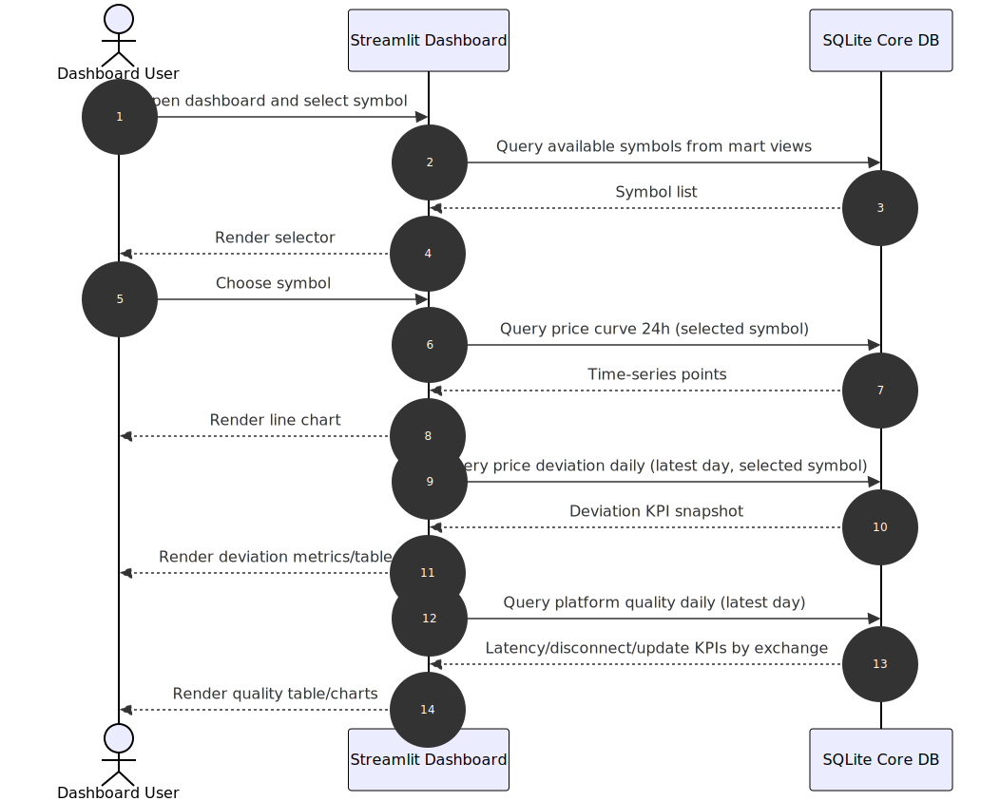

# Crypto Data Engineering
## DWH Pipeline und Dashboard MVP

Masterarbeit Projektstand

- Datum: 2026-02-23
- Fokus: Messwerte sichtbar machen, bevor Forecasting startet

---

# Agenda

1. Problem und Zielbild
2. DWH Architektur und Datenfluss
3. KPI Definitionen und Qualitaetssicherung
4. Dashboard MVP und aktueller Stand
5. Risiken, offene Punkte, naechste Schritte

---

# Problem und Zielbild

## Problem
- Gleiche Kryptowaehrung wird auf verschiedenen Exchanges unterschiedlich gepreist.
- Datenqualitaet und Plattformstabilitaet unterscheiden sich stark.
- Ohne KPI-Layer ist ein fairer Exchange-Vergleich schwer.

## Zielbild
- Reproduzierbare DWH-Pipeline fuer Markt- und Betriebsdaten.
- Vergleichbare KPIs pro Exchange und Symbol.
- Dashboard fuer schnelle Analyse von Preisabweichung und Plattformqualitaet.

---

# Zielarchitektur (Uebersicht)



---

# Pipeline Details (1/2)

## Ingestion
- CCXT Websocket / Marktstream pro Exchange.
- Speicherung in SQLite mit Ingestion-Timestamp pro Tick.
- Operational Supervision fuer Worker und Reconnect.

## Staging
- Taeglicher Export des letzten 24h Fensters.
- Entkopplung zwischen Online-Ingestion und Downstream-Transformation.

---

# Pipeline Details (2/2)

## Cleansing
- Resampling auf konsistentes Zeitraster.
- Fill-Strategien: observed, forward_fill, interpolation.
- Data-Quality Checks auf Nullwerte, Duplikate, Ausreisser.

## Core
- KPI Views fuer Latency, Update-Frequenz, Disconnects, Price Deviation.
- Validierungsregeln mit SQL Assertions und Report-Ausgabe.

---

# KPI Definitionen (Kernmetriken)

## Plattformqualitaet
- Latency (ms): min / avg / max pro Exchange.
- Update Frequency (Hz): aus Tick-Intervall abgeleitet.
- Disconnect Count: Anzahl `disconnect` Events pro Zeitraum.

## Preisabweichung
- `max_price_diff_abs`: maximale absolute Differenz zwischen Exchanges.
- `max_price_diff_pct`: maximale relative Differenz in Prozent.
- Zeitlich ausgerichtet ueber Bucket-Timestamps.

---

# Mart Layer als Dashboard Contract

Verwendete Views:

- `vw_mart_dashboard_platform_quality_daily`
- `vw_mart_dashboard_price_deviation_daily`
- `vw_mart_dashboard_price_curve_24h_binance`

Prinzip:
- KPI-Logik bleibt in SQL Views.
- Dashboard liest nur konsumfertige Daten.
- Keine ad-hoc KPI-Berechnung in der UI.

---

# Dashboard MVP (Implementiert)

Bestandteile:
- Symbol-Selector
- 24h Price Curve (Binance Baseline)
- Daily Price Deviation Snapshot
- Daily Platform Quality Snapshot

Technik:
- Streamlit App: `scripts/5_marts/dashboard_mvp_app.py`
- Datenquelle: `data/core/core_kpi.db` mit Mart Views

---

# Dashboard Laufzeitfluss



---

# Bisherige Beobachtungen aus Messlaeufen

- Erste Volumenschaetzung: ca. `90 GB/Tag` (basierend auf 12h Vorlaufmessung).
- Exchange Coverage: nur ein Teil der CCXT-Exchanges liefert stabil Daten.
- Home-Network Betrieb kann Disconnect-KPIs verfaelschen.
- Staging Laufzeiten aktuell noch relativ hoch fuer schnelle Iterationen.

Quelle:
- `docs/0_overview/insights.md`

---

# Qualitaetssicherung und Betrieb

Aktuelle Guards:
- `core_pipeline.py` mit `fast/full/both` Phasen.
- SQL Assertions mit Error/Warn Trennung.
- JSON/Markdown Reports unter `logs/core_validation/`.

Operatives Ziel:
- Taeglicher Standardablauf:
1. Core Build + Validation
2. Mart Views anwenden
3. Dashboard Refresh

---

# Offene Punkte

- Einheitliche Symbol-Normalisierung ueber alle Exchanges final absichern.
- Verbindliche Definition fuer "Connection Drop" dokumentieren.
- Zeit-Synchronisierung und Resampling-Regeln fuer Vergleichbarkeit fixieren.
- Dashboard Tests fuer SQL Contracts und leere Datenfenster hinzufuegen.

---

# Roadmap (Naechste Schritte)

1. Dashboard Hardening
   - Integrations-/Smoke-Tests fuer Query Contracts
   - Runbook fuer taeglichen Refresh
2. Forecasting Contract
   - Feature- und Label-Fenster definieren
   - Train/Validation Split je Exchange/Symbol
3. Forecasting Baseline
   - Start mit klassischen Modellen (z. B. Ridge)
   - Danach Vergleich mit modernen Time-Series Modellen

---

# Demo Kommando

```bash
pip install -r requirements.txt
streamlit run scripts/5_marts/dashboard_mvp_app.py
```

Danke.
