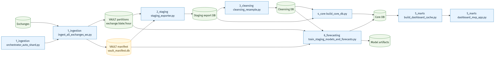
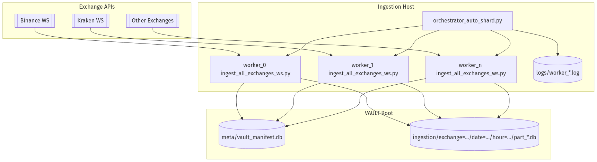
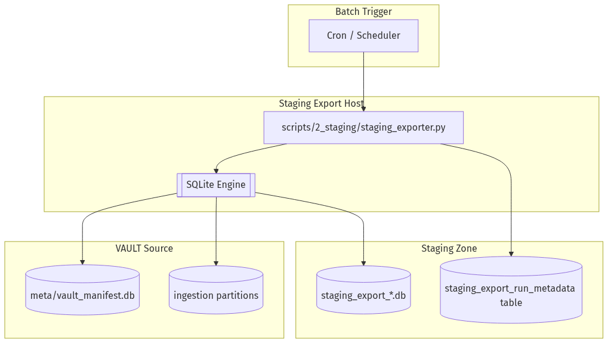
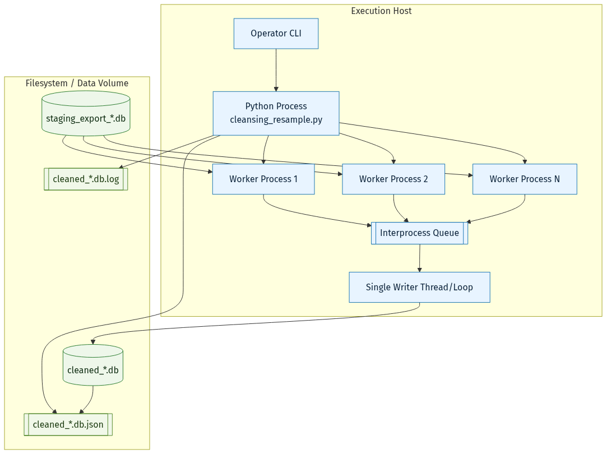
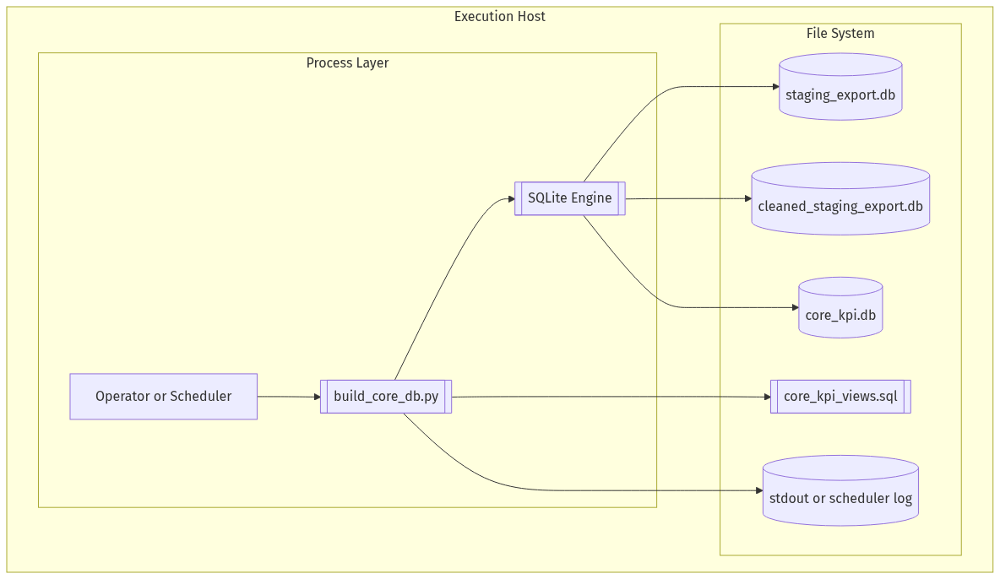
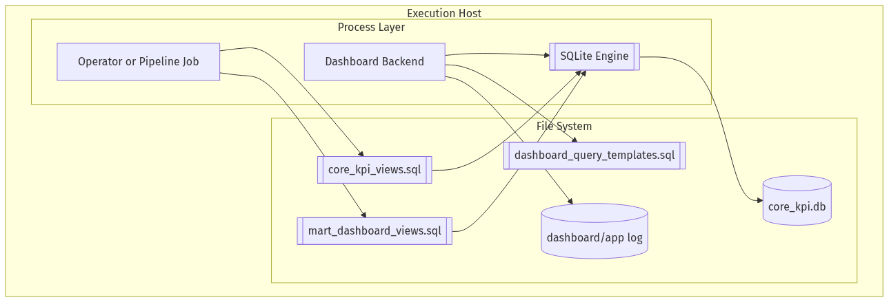
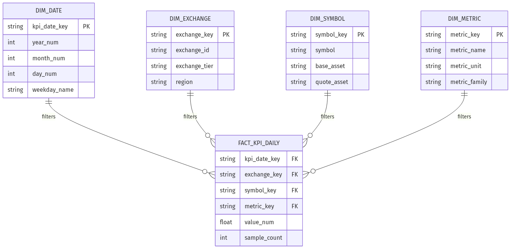
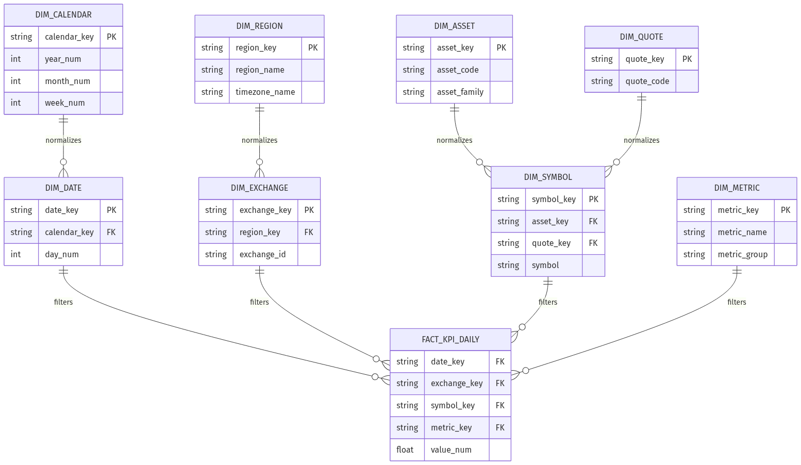
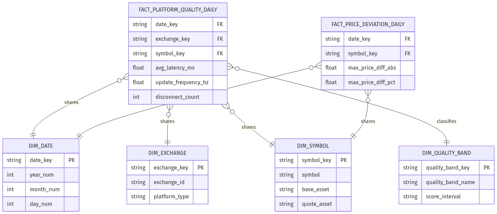

# Crypto DWH Leitfaden fuer Data Engineers
## Datenfluss, Verarbeitung, Deployment pro Schritt

Trainingsfolien fuer Data-Engineering-Auszubildende

- Datum: 2026-02-26
- Fokus: Von Rohdaten bis Data Mart und Dashboard

---

# Lernziele

Nach dieser Session koennt ihr:

1. den End-to-End Datenfluss der Pipeline erklaeren.
2. pro Schritt Zweck, Input, Output und Deployment verstehen.
3. `OLTP` und `OLAP` in dieser Architektur korrekt einordnen.
4. `Star`, `Snowflake`, `Galaxy` und `Data Mart` am Projektbeispiel unterscheiden.

---

# Agenda

1. Problem und Zielbild
2. Pipeline-Schritte mit Deployment-Diagrammen
3. ETL, OLTP, OLAP im Projektkontext
4. Data Mart + Schema-Patterns (Star/Snowflake/Galaxy)
5. Operativer Leitfaden fuer den taeglichen Betrieb

---

# Problem und Zielbild

## Problem
- Gleiche Coins haben je Exchange unterschiedliche Preise.
- Plattformqualitaet (Latency, Update-Frequenz, Disconnects) schwankt.
- Ohne saubere Zeitausrichtung sind Vergleiche nicht fair.

## Zielbild
- Nachvollziehbare DWH-Pipeline von Ingestion bis Mart.
- Vergleichbare KPI je Symbol und Exchange.
- Dashboard als schneller Analysezugang.

---

# End-to-End Datenfluss (Uebersicht)



---

# ETL/ELT in diesem Projekt

## Praktische Sicht
- **E (Extract):** WebSocket-Ticks und Connection-Events aus Exchanges.
- **L (Load):** Zuerst in Raw-DBs (OLTP-nah, write-optimiert).
- **T (Transform):** In Staging/Cleansing/Core/Marts fuer Analyse.

## Warum so?
- Online-Ingestion bleibt stabil.
- Batch-Transformationen koennen reproduzierbar laufen.

---

# OLTP vs OLAP im Projekt

## OLTP-Zone (schreibintensiv)
- `worker_*_crypto_ws_ticks.db`
- viele Inserts, laufender Betrieb, technische Rohdaten

## OLAP-Zone (lese- und analyseintensiv)
- `cleaned_*.db`, `core_kpi.db`, Mart-Views/Cache
- aggregierte KPI, zeitliche Vergleiche, Dashboard-Abfragen

---

# Schritt 1: Ingestion (Extract + Raw Load)

## Verarbeitung
- Orchestrator shardet Exchanges auf Worker-Prozesse.
- Worker schreiben Ticks und Events kontinuierlich in SQLite.
- Restart- und Supervision-Logik stabilisiert den 24/7-Betrieb.

## Ergebnis
- Rohdaten mit Ingestion-Timestamp als Basis fuer spaetere KPI.

## Deployment




---

# Schritt 2: Staging (Entkopplung)

## Verarbeitung
- Geplanter Job exportiert ein Zeitfenster (z. B. letzte 24h).
- Optional inkrementell ueber Watermark-State.
- Lauf erzeugt Datenexport plus Metadaten-JSON.

## Ergebnis
- Stabile Input-Scheibe fuer Cleansing und Core.

## Deployment



---

# Schritt 3: Cleansing (Zeitliche Vergleichbarkeit)

## Verarbeitung
- Resampling auf ein einheitliches Raster (z. B. 60s Bins).
- Fill-Strategien: `observed`, `forward_fill`, optional `interpolation`.
- Qualitaetsflags markieren `missing`, `stale`, Alter der Werte.

## Ergebnis
- Vergleichbare Zeitreihen pro `(exchange_id, symbol)`.

## Deployment



---

# Schritt 4: Core (KPI-Berechnung, OLAP Kern)

## Verarbeitung
- KPI-Views fuer:
  - `latency_ms`
  - `update_frequency_hz`
  - `disconnect_count`
  - `price_diff_abs` / `price_diff_pct`
- SQL Assertions validieren Datenqualitaet und Vollstaendigkeit.

## Ergebnis
- Konsistente KPI-Schicht als Single Source of Truth.

## Deployment



---

# Schritt 5: Marts (Analyse-Verbrauchsschicht)

## Verarbeitung
- Mart-Views formen KPI fuer konkrete Analysefragen um.
- Dashboard liest nur konsumfertige Views/Cache-Tabellen.
- Keine KPI-Neuberechnung in der UI.

## Ergebnis
- Schnelle, konsistente Auswertung fuer Fachnutzer.

## Deployment



---

# Data Mart im Projekt

## Was ist der Data Mart hier?
- Themenbezogener Ausschnitt fuer Dashboard-Konsum.
- Fokus: Preisabweichung und Plattformqualitaet.

## Konkrete Objekte
- `vw_mart_dashboard_platform_quality_daily`
- `vw_mart_dashboard_price_deviation_daily`
- `vw_mart_dashboard_price_curve_24h_binance`

---

# Star Schema (einfach, schnell konsumierbar)

Empfehlung:
- fuer stabile Dashboard-KPI mit klaren Dimensionen.



---

# Snowflake Schema (staerker normalisiert)

Empfehlung:
- wenn Dimensionen wachsen und Redundanz gesenkt werden soll.

Trade-off:
- weniger Duplikate, aber komplexere Joins.



---

# Galaxy Schema (mehrere Facts, geteilte Dimensionen)

Empfehlung:
- wenn mehrere Analysebereiche parallel laufen.
- hier: Plattformqualitaet und Preisabweichung als getrennte Facts.



---

# Wann welches Schema?

1. **Star**: Startpunkt fuer MVP-Dashboard, einfache SQL, schnelle Lieferung.
2. **Snowflake**: bei vielen Dimension-Attributen und Governance-Fokus.
3. **Galaxy**: bei mehreren Fact-Domaenen mit gemeinsamen Dimensionen.

Praxisempfehlung:
- MVP mit Star starten, bei Bedarf zu Snowflake/Galaxy evolvieren.

---

# Operativer Leitfaden (taeglicher Ablauf)

1. Ingestion laeuft kontinuierlich (Health und Disconnects beobachten).
2. Staging exportiert den Zielzeitraum.
3. Cleansing erzeugt zeitlich ausgerichtete Serien.
4. Core berechnet/validiert KPI.
5. Mart-Views und Cache refreshen.
6. Dashboard fuer Analyse freigeben.

---

# Qualitaets-Checkliste fuer Auszubildende

- Sind alle Zeitstempel in UTC?
- Ist Symbol-Mapping exchange-uebergreifend konsistent?
- Sind Missing/Stale-Werte sichtbar markiert?
- Ist die Definition von "Connection Drop" dokumentiert?
- Werden KPI nur im SQL-Layer gerechnet (nicht in UI)?

---

# PDF-Erzeugung aus Markdown

Beispiel mit Marp CLI:

```bash
npx @marp-team/marp-cli docs/7_presentation/crypto_dwh_data_engineering_leitfaden_slides.md --allow-local-files -o docs/7_presentation/crypto_dwh_data_engineering_leitfaden_slides.pdf
```

Die Datei ist Marp-kompatibel und fuer direkten PDF-Export vorbereitet.
